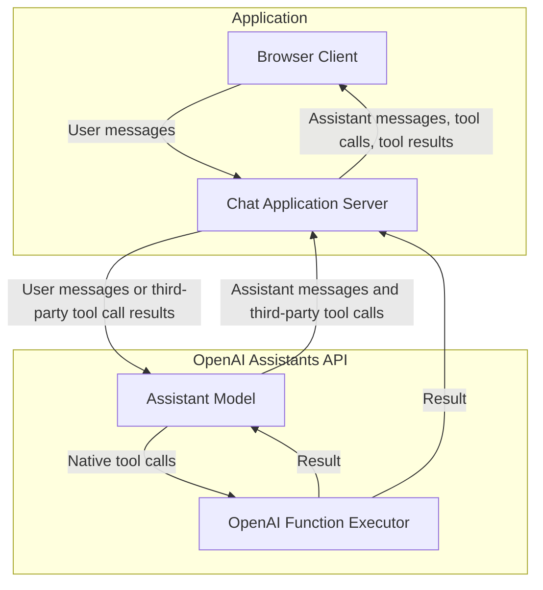

# Быстрый старт с OpenAI Responses API на Python, Jinja2, FastAPI и HTMX

Шаблон быстрого старта, использующий OpenAI [Responses API](https://platform.openai.com/docs/api-reference/responses) с [Python](https://www.python.org/), [FastAPI](https://fastapi.tiangolo.com/), [Jinja2](https://jinja.palletsprojects.com/en/3.1.x/) и [HTMX](https://htmx.org/). Форкнут из репозитория [openai-assistants-python-quickstart](https://github.com/Promptly-Technologies-LLC/openai-assistants-python-quickstart) после недавнего устаревания Assistants API.

## Что нового?

Главное архитектурное отличие на высоком уровне между двумя API заключается в том, что теперь вы должны хранить конфигурацию ассистента — например, его инструменты и инструкции — в локальном хранилище, а не на серверах OpenAI. Это упрощает замену набора инструментов прямо во время разговора. Новый API также упрощает ветвление (форкинг) бесед; он по-прежнему поддерживает хранение диалогов с сохранением состояния, но при желании вы можете редактировать историю или управлять состоянием локально.

Улучшения на низком уровне включают:

- Встроенный инструмент веб-поиска
- Встроенный инструмент генерации изображений
- Инструмент управления компьютером (computer use)
- Поддержка вызова инструментов через удалённые MCP-серверы
- Поддержка большего числа моделей

Обратите внимание, что данный шаблон пока не поддерживает генерацию изображений.

## Быстрый старт

### 1. Клонируйте репозиторий

```shell
git clone https://github.com/Promptly-Technologies-LLC/openai-responses-python-quickstart.git
cd openai-responses-python-quickstart
```

### 2. Установите зависимости

```shell
uv sync
```

### 3. Запустите сервер FastAPI

```shell
uv run uvicorn main:app --reload
```

### 4. Перейдите по адресу [http://localhost:8000](http://localhost:8000).

### 5. Укажите ваш OpenAI API key и настройте ассистента в графическом интерфейсе

## Использование

Перейдите на страницу `/setup` в любое время, чтобы настроить ассистента:


Перейдите на страницу `/chat`, чтобы начать чат-сессию:


Если ваш OPENAI_API_KEY не задан, вы будете перенаправлены на `/setup`, где сможете его указать. (Значение будет сохранено в файле `.env` в корне проекта.) Аналогично, если ассистент не настроен, вы будете перенаправлены на `/setup` для его настройки.

Ассистент поддерживает многошаговые сценарии с несколькими связанными вызовами инструментов, включая поиск по файлам, выполнение кода и вызов пользовательских функций. Вызовы инструментов отображаются в чате по мере их обработки.

## Архитектура

Когда клиент отправляет сообщение на сервер приложения, сервер пересылает его в OpenAI Responses API. Ассистент может ответить либо сообщением пользователю (которое сервер просто пересылает клиенту), либо вызовом инструмента (который должен быть выполнен, прежде чем ассистент продолжит беседу).

Responses API поддерживает семь типов вызовов инструментов:

- Code Interpreter (интерпретатор кода)
- Computer use (управление компьютером)
- Пользовательские функции
- File search (поиск по файлам)
- Генерация изображений
- MCP-инструменты
- Веб-поиск

Вызовы инструментов Code Interpreter, поиск по файлам, генерация изображений и веб-поиск выполняются на серверах OpenAI, тогда как вызовы computer use, пользовательских функций и MCP-инструментов выполняются на сервере приложения.

Для вызовов пользовательских функций ассистент отправляет серверу приложения JSON-объект с именем функции и аргументами (который сервер приложения пересылает клиенту для отображения). Сервер приложения затем выполняет функцию и возвращает результат как ассистенту, так и клиенту. После этого ассистент отвечает серверу приложения либо новым вызовом инструмента, либо финальным сообщением пользователю с интерпретацией результатов, которое сервер пересылает клиенту.



## Определение пользовательских функций

Определите пользовательскую Python-функцию в файле в папке `utils`. Функция должна принимать сериализуемые типы входных данных и возвращать сериализуемый тип результата. Желательно аннотировать каждое поле описанием с помощью `typing.Annotated` и `pydantic.Field`, поскольку эти описания передаются ассистенту. Ассистенту также передаётся docstring функции. Пример функции `get_weather` приведён в `utils/custom_functions.py`.

При необходимости вы можете определить пользовательский HTML-шаблон в файле в папке `templates/components`. Если шаблон предоставлен, результаты вызова функции будут отображаться в интерфейсе чата с его помощью. Шаблон должен принимать единственный входной параметр `tool` типа `FunctionResult`:

```python
class FunctionResult(BaseModel, Generic[T]):
    error: Optional[str] = None
    warning: Optional[str] = None
    result: Optional[T] = None
```

Шаблон должен обрабатывать как случай с результатом (для отображения результатов вызова функции конечному пользователю), так и случай с ошибкой (для уведомления пользователя о неудачном вызове функции). Обработка предупреждения (warning) необязательна.

Пример шаблона `weather-widget.html` приведён в папке `templates/components`.

После определения функции (и, при необходимости, шаблона) запустите сервер и перейдите на страницу `/setup`, чтобы зарегистрировать функцию и шаблон.


Не забудьте нажать «Regenerate tool.config.json», чтобы сохранить изменения. (Это перегенерирует файл `tool.config.json` с вашей новой конфигурацией.)

## Настройка Computer Use

Инструмент computer use позволяет ассистенту управлять виртуальным экраном, отправляя действия мыши и клавиатуры (клик, ввод текста, прокрутка и т.д.) и получая скриншоты в ответ.

По умолчанию этот шаблон использует браузер Playwright в headless-режиме в качестве бэкенда для computer use. Когда ассистент начинает сессию computer use, он видит стартовую страницу с полем ввода URL для перехода на веб-сайты.

Чтобы заменить бэкенд (например, на полноценный виртуальный рабочий стол через VNC/xdotool или библиотеку автоматизации GUI, такую как pyautogui), реализуйте протоколы `ComputerSession` и `ComputerSessionManager`, определённые в `utils/computer_use.py`:

```python
from utils.computer_use import ComputerSession, ComputerSessionManager, Action

class MySession:
    """Ваша пользовательская сессия — должна реализовывать протокол ComputerSession."""

    async def screenshot(self) -> str:
        """Захват экрана и возврат base64-кодированной строки PNG."""
        ...

    async def execute(self, action: Action) -> str:
        """Выполнить действие (клик, ввод текста и т.д.) и вернуть скриншот."""
        ...

    async def close(self) -> None:
        """Освободить ресурсы."""
        ...

class MySessionManager:
    """Ваш пользовательский менеджер — должен реализовывать протокол ComputerSessionManager."""

    def get_or_create(self, conversation_id: str, width: int = 1024, height: int = 768) -> MySession:
        ...

    async def close(self, conversation_id: str) -> None:
        ...

    async def close_all(self) -> None:
        ...
```

Затем замените синглтон `session_manager` в `utils/computer_use.py`:

```python
session_manager: ComputerSessionManager = MySessionManager()
```

Другие изменения не требуются — чат-роутер и логика завершения работы используют `session_manager` через интерфейс протокола.
